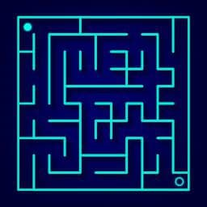

# DOCTOR WHERE



##  <a name='Tableofcontents'></a>Table of contents

<!-- vscode-markdown-toc -->
 1. [ Introduction](#Introduction)
 2. [ Installation manual fd](#Installationmanualfd)
 3. [ Context and instructions](#Contextandinstructions)
 4. [ Packages and dependencies](#Packagesanddependencies)
 5. [ Structure](#Structure)

	 5.1. [Images and videos](#Imagesandvideos)

	 5.2. [Code examples](#Codeexamples)
 6. [ Documentation](#Documentation)
 7. [ License](#License)

<!-- vscode-markdown-toc-config
	numbering=true
	autoSave=true
	/vscode-markdown-toc-config -->
<!-- /vscode-markdown-toc -->


##  1. <a name='Introduction'></a> Introduction

This is my first project for [CORE Code School](https://www.corecode.school/).

You can play it [here](https://yolmm.github.io/Doctor-where/).

##  2. <a name='Installationmanualfd'></a> Installation manual

```bash
#Clone the repository:
git clone https://yolmm.github.io/Doctor-where/

#Initiate npm:
npm init
#Or use this instead:
npm init -y

#Install dependencies:
npm install

#Execute the project:
npm run dev
```

##  3. <a name='Contextandinstructions'></a> Context and instructions

"People assume that time is a strict progression of cause to effect, but actually from a non-linear non-subjective viewpoint it's more like a big ball of wibbly wobbly timey wimey [stuff](https://youtu.be/cwdbLu_x0gY)."

Time War is finally over and the Doctor has just regenerated, so he can be a traveller once again and keep exploring time and space while battling injustice. All he has to do is going inside the TARDIS (Was that big inside all the time? 🤔), find a companion and have fun. But where is the TARDIS? More important, where is he? And why those angel statues are so sad?

It looks like the Doctor is in the middle of a labyrinth and the TARDIS is outside of it. Help the Doctor reaching the TARDIS with the arrow keys and avoid the Weaping Angels. There aren't any wrong path; there is the path that leads you to the TARDIS and you can find objects or a companion in the other paths.

"Don't turn your back, don't look away, and don't blink. Good luck."

##  4. <a name='Packagesanddependencies'></a> Packages and dependencies

- Node package manager: [npm](https://www.npmjs.com/)
- To run the HTML: [parcel](https://www.npmjs.com/package/parcel)
- To run the HTML while working on the project: [ts-node-dev](https://www.npmjs.com/package/ts-node-dev)
- Language used [typescript](https://www.npmjs.com/package/typescript)

##  5. <a name='Structure'></a> Structure

###  5.1. <a name='Imagesandvideos'></a>Images and videos

###  5.2. <a name='Codeexamples'></a>Code examples

##  6. <a name='Documentation'></a> Documentation

Doctor Who [info](https://en.wikipedia.org/wiki/Doctor_Who)

To create the main characters: [sprite sheet generator](https://sanderfrenken.github.io/Universal-LPC-Spritesheet-Character-Generator/#?body=Humanlike_white)

##  7. <a name='License'></a> License